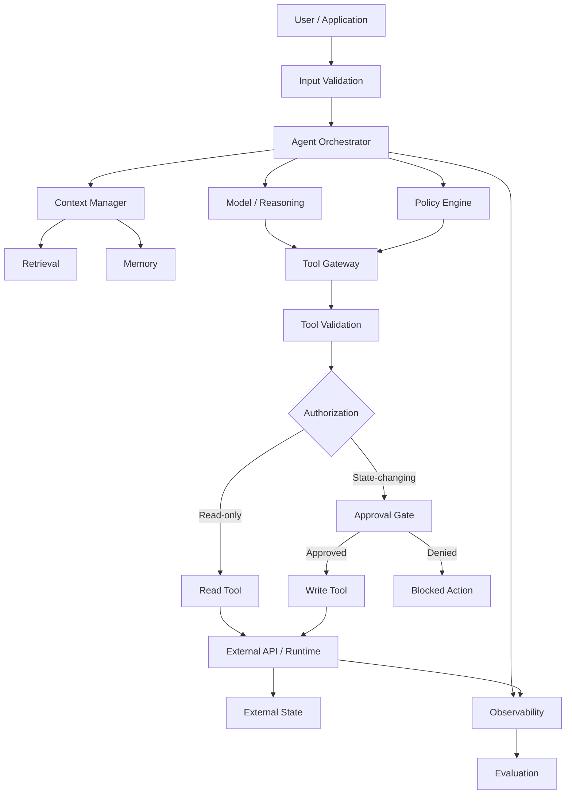
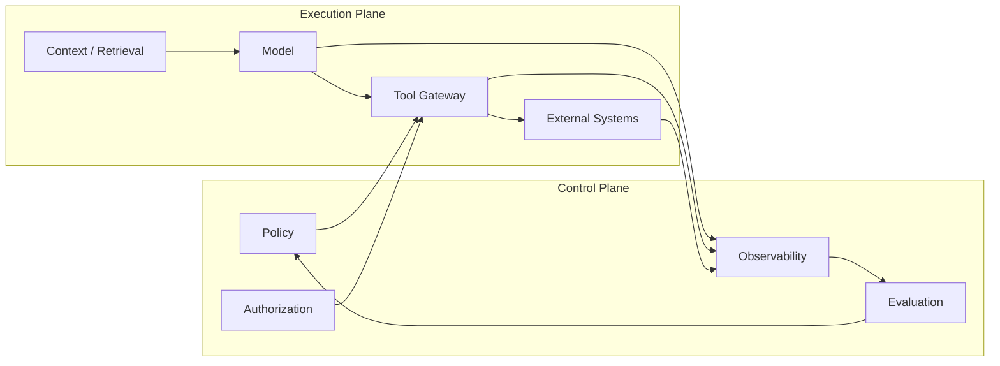
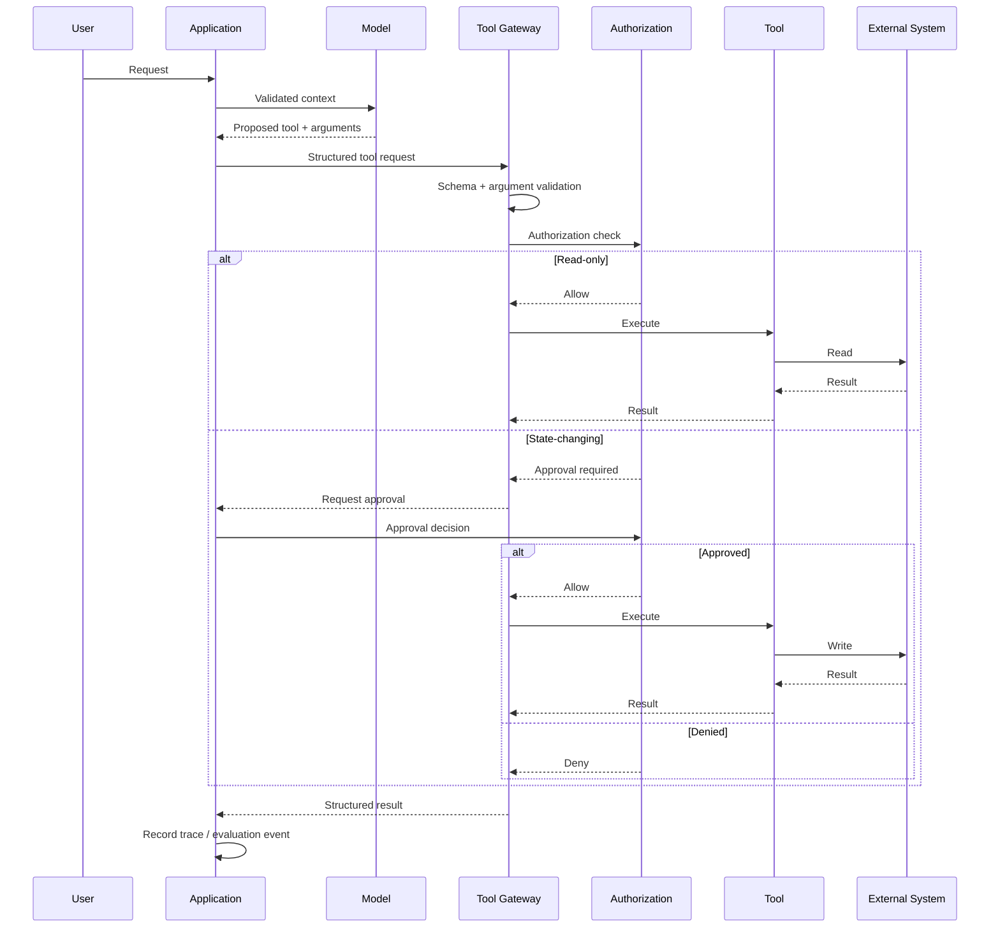
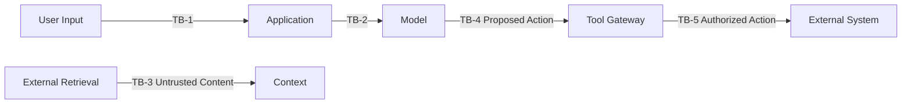
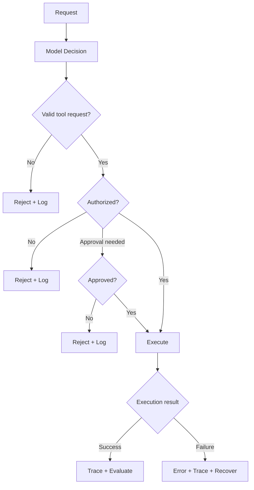
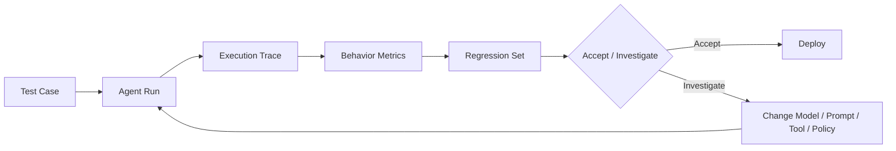
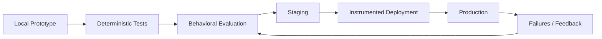

# System Architecture

This document describes the reference architecture used in the **From LLM to Reliable AI Agent** session.

## 1. End-to-end architecture

### Architectural rule

> **The model proposes; application code authorizes.**

The model can propose a tool and arguments. It should not be the final authority for identity, permissions, irreversible actions, or access to protected state.

---

## 2. Control-plane vs execution-plane

This separation makes operational controls independent from model behavior.

---

## 3. Tool execution sequence

---

## 4. Trust boundaries

Every boundary should have an explicit control rather than relying on the model to enforce it.

| Boundary | Control |
|---|---|
| User → Application | Input validation and identity |
| Application → Model | Context and data minimization |
| Retrieval → Context | Treat content as untrusted |
| Model → Tool Gateway | Structured contracts and validation |
| Tool Gateway → External System | Authorization and least privilege |
| Runtime → Operations | Audit events, traces, metrics, evaluation |

---

## 5. Failure containment

The objective is not to eliminate every failure. It is to **bound failure, make it visible, and prevent an invalid model output from becoming an uncontrolled external action**.

---

## 6. Evaluation loop

Recommended evaluation dimensions:

- Outcome
- Tool selection
- Tool arguments
- Trajectory
- Grounding
- Safety
- Latency/cost where relevant
- Regression against prior cases

---

## 7. Production path

A prototype becomes production-oriented when the system has explicit controls around **execution, authorization, evaluation, and operations**, not simply when a model API is connected.

## Design principles

1. **Explicit contracts** — every tool has a defined purpose and input shape.
2. **Least privilege** — tools receive only the permissions they need.
3. **External authorization** — permissions are enforced by application code.
4. **Approval for high-impact actions** — risky state changes can require human or policy approval.
5. **Untrusted retrieval** — retrieved text is data, not policy.
6. **Observable execution** — important decisions and tool calls are traceable.
7. **Behavioral evaluation** — evaluate the agent's actions, not only its final prose.
8. **Reproducibility** — examples should be runnable and inspectable locally.
