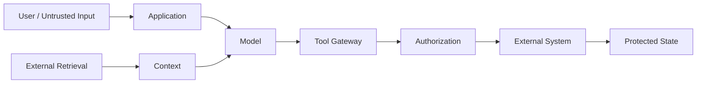
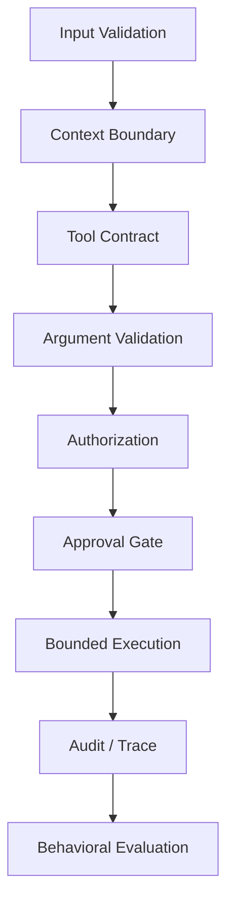

# Agent Threat Model

This threat model identifies the main security boundaries and failure modes discussed in the session. It is an engineering reference, not a guarantee that a system is secure.

## 1. Assets

- User data
- Credentials and secrets
- Application state
- External API permissions
- Model context
- Tool definitions and schemas
- Evaluation datasets and results
- Audit and telemetry data

## 2. Trust-boundary diagram

## 3. Threat categories

| Threat | Failure mode | Primary control |
|---|---|---|
| Prompt injection | Untrusted content changes model behavior | Treat retrieved content as data; constrain tool permissions |
| Excessive agency | Agent has more capability than the task requires | Least privilege and narrow tool contracts |
| Unsafe arguments | Model proposes malformed or dangerous parameters | Schema validation and semantic validation |
| Unauthorized action | Tool executes without sufficient permission | Server-side authorization |
| Sensitive-data exposure | Secrets or private data enter model/tool context | Data minimization and access controls |
| State-changing action | Agent modifies external state unexpectedly | Approval gates and explicit policy |
| Tool abuse | Tool is used outside its intended purpose | Tool-level authorization and monitoring |
| Untraceable failure | No evidence of what the agent did | Structured traces and audit events |
| Evaluation gap | Tests measure prose but miss unsafe behavior | Behavioral and trajectory evaluation |

## 4. Defense-in-depth

No single layer should be treated as the complete security boundary.

## 5. Risk handling

For each tool, document:

- Purpose
- Required inputs
- Read/write capability
- Required permissions
- Approval requirements
- Failure behavior
- Logging requirements
- Data accessed
- Expected evaluation cases

## 6. Security review questions

Before production use, ask:

1. What can this tool change?
2. What is the minimum permission it needs?
3. Can untrusted retrieved content influence the tool request?
4. Are tool arguments validated outside the model?
5. Who authorizes the action?
6. Which actions require approval?
7. What happens when authorization fails?
8. Can the action be reversed?
9. What is logged?
10. Which evaluation cases demonstrate that the control works?

## 7. Security principle

> **Do not give the model authority that the application can enforce deterministically.**
